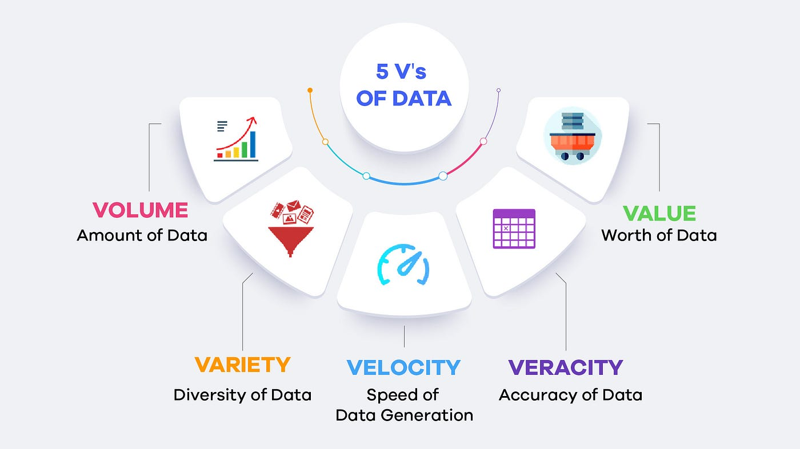

## Big Data
Big data refers to extremely large and complex sets of data that cannot be easily managed, processed, or analyzed using traditional methods or tools.

### What are traditional methods and tools?
Traditional methods and tools for data management are designed to handle smaller, simpler datasets, typically structured and stored in relational databases. These include:
- RDBMS: MySQL, PostGreSQL, Oracle DB
- Desktop Applications: Ms Excel, Ms Access
- Single-Node Processing: Systems that run on a single machine, such as standalone servers.
        - Struggle with scalability and parallel processing.
- Batch Processing: Tools that process data in fixed intervals, like traditional ETL (Extract, Transform, Load)pipelines.
        - Not suited for real-time or high-velocity data.

### What is Big Data emerging?
Big data emerged due to rapid data growth from sources like social media and IoT, the need to handle complex data types, demand for real-time insights, advancements in technology, and the pursuit of a competitive edge through data-driven decisions.

### What are 5 V's of Big Data?

