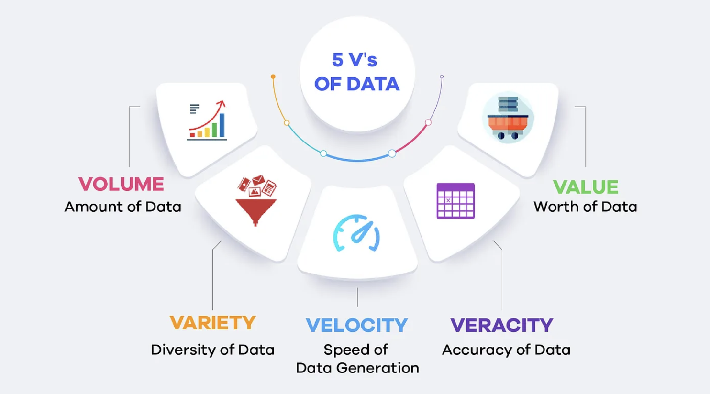

## Big Data
Big data refers to extremely large and complex sets of data that cannot be easily managed, processed, or analyzed using traditional methods or tools.

### What are traditional methods and tools?
Traditional methods and tools for data management are designed to handle smaller, simple datasets, typically structured and stored in relational databases. These include:
- RDBMS: MySQL, PostGreSQL, Oracle DB
- Desktop Applications: Ms Excel, Ms Access
- Single-Node Processing: Systems that run on a single machine, such as standalone servers.
        - Struggle with scalability and parallel processing.
- Batch Processing: Tools that process data in fixed intervals, like traditional ETL (Extract, Transform, Load)pipelines.
        - Not suited for real-time or high-velocity data.

### Why is Big Data emerging?
Big data emerged due to rapid data growth from sources like social media and IoT, the need to handle and complex data types, demand for real-time insights, advancements in technology, and the pursuit of a competitive edge through data-driven decisions.

### What are 5 V's of Big Data?

#### 1. Volume
| Type              | Definition                                                     |
|-------------------|---------------------------------------------------------------|
| Structured Data   | Organized data like tables (e.g., spreadsheets, SQL databases).|
| Unstructured Data | Raw data like images, videos, or social media posts.           |
| Semi-structured   | Data with some structure, like JSON or XML files.              |

#### 2. Variety
| Type             | Definition                                                     |
|------------------|---------------------------------------------------------------|
| Text             | Emails, documents, or social media messages.                  |
| Media            | Images, videos, audio files.                                  |
| Machine Data     | Logs, IoT sensor data, clickstreams.                          |

#### 3. Velocity
| Type             | Definition                                                     |
|------------------|---------------------------------------------------------------|
| Batch Processing | Data processed in chunks over time (e.g., ETL jobs).           |
| Real-time Data   | Data processed instantly (e.g., stock prices, live tracking).  |
| Streams          | Continuous data flow from sensors or IoT devices.             |

#### 4. Veracity
| Type             | Definition                                                     |
|------------------|---------------------------------------------------------------|
| Accurate Data    | Reliable and error-free data.                                  |
| Biased Data      | Data with errors or incomplete information.                    |
| Noisy Data       | Data with irrelevant or misleading information.                |

#### 5. Value
| Type              | Definition                                                    |
|-------------------|--------------------------------------------------------------|
| Business Insights | Actionable insights for better decisions.                     |
| Predictive Models | Forecasting future trends or outcomes.                        |
| Optimization      | Enhancing processes based on data analysis.     

### Conclusion
- Volume alone doesn't imply Big Data