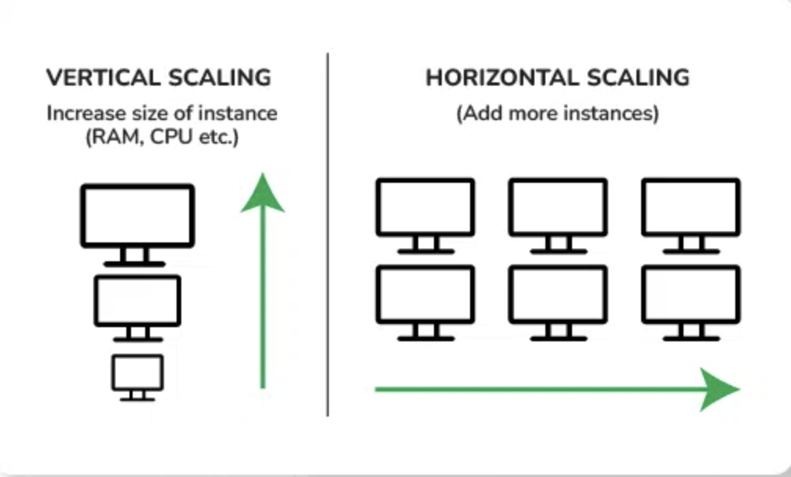

## Distributed Systems

<<<<<<< HEAD
=======

### 1. Horizontal Scaling
Definition: Adding more machines (nodes) to a system to distribute the load.
How it works: Data is split and stored across multiple servers. As the workload increases, more servers are added to handle the load.
Example: Systems like Hadoop and NoSQL databases (e.g., Cassandra, MongoDB) use horizontal scaling to manage massive datasets by adding more nodes to the cluster.

### 2. Vertical Scaling
Definition: Adding more resources (CPU, memory, storage) to an existing machine to improve its performance.
How it works: Instead of adding more machines, you enhance the capabilities of a single machine to handle more data.
Example: Traditional databases like SQL servers often rely on vertical scaling, where more power is added to the existing hardware.
In big data, horizontal scaling is more commonly used because it allows systems to scale out more easily and handle growing data volumes effectively.
