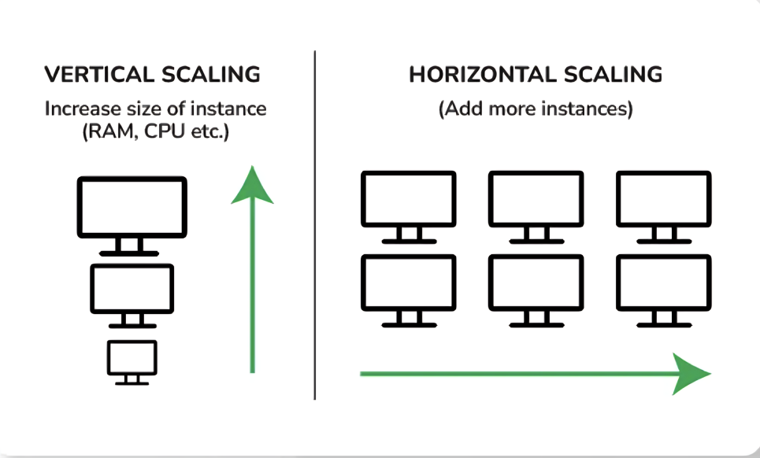

## System/Scaling Types

### 1. Horizontal Scaling
It is also known as multiple systems/ Distributed Architecture
Definition: Adding more machines (nodes) to a system to distribute the load.
How it works: Data is split and stored across multiple servers. As the workload increases, more servers are added to handle the load.
Example: Systems like Hadoop and NoSQL databases (e.g., Cassandra, MongoDB) use horizontal scaling to manage massive datasets by adding more nodes to the cluster.

### 2. Vertical Scaling
It is also known as single system/ Monolithic Architecture
Definition: Adding more resources (CPU, memory, storage) to an existing machine to improve its performance.
How it works: Instead of adding more machines, you enhance the capabilities of a single machine to handle more data.
Example: Traditional databases like SQL servers often rely on vertical scaling, where more power is added to the existing hardware.

### Conclusion
- Horizontal scaling improves performance by distributing the workload across multiple nodes, enhancing fault tolerance and scalability, while vertical scaling boosts performance by increasing the power of a single system but it is not true scaling because Vertical scaling (e.g., 1GB to 10GB RAM) may not give proportional performance gains(1x to 10x) due to diminishing returns, while horizontal scaling can achieve more linear improvements by distributing the load.

- All big data systems are based on distributed architecture
