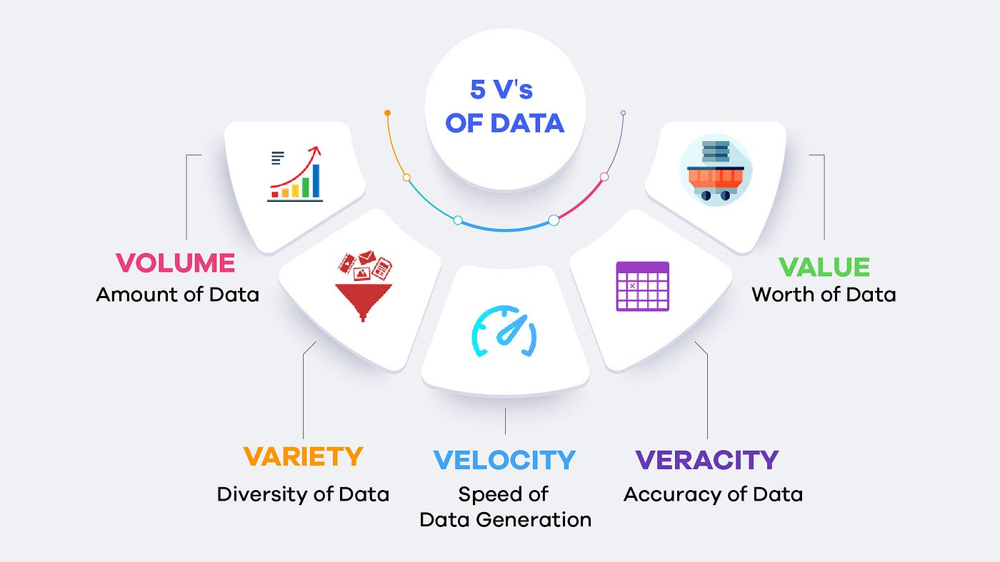

## Big Data
Big data refers to extremely large and complex sets of data that cannot be easily managed, processed, or analyzed using traditional methods or tools.

### What are traditional methods and tools?
Traditional methods and tools for data management are designed to handle smaller, simple datasets, typically structured and stored in relational databases. These include:
- RDBMS: MySQL, PostGreSQL, Oracle DB
- Desktop Applications: Ms Excel, Ms Access
- Single-Node Processing: Systems that run on a single machine, such as standalone servers.
        - Struggle with scalability and parallel processing.
- Batch Processing: Tools that process data in fixed intervals, like traditional ETL (Extract, Transform, Load)pipelines.
        - Not suited for real-time or high-velocity data.

### Why is Big Data emerging?
Big data emerged due to rapid data growth from sources like social media and IoT, the need to handle and complex data types, demand for real-time insights, advancements in technology, and the pursuit of a competitive edge through data-driven decisions.

### What are 5 V's of Big Data?

#### 1. **Volume**
The size of data to be processed or stored.

| **Type**            | **Definition**                                                   |
|---------------------|------------------------------------------------------------------|
| **Structured Data**  | Organized data in fixed formats, such as tables (e.g., spreadsheets, SQL databases). |
| **Unstructured Data**| Raw data without a predefined structure, such as images, videos, or social media posts. |
| **Semi-structured**  | Data with some structure, often in formats like JSON or XML files. |

#### 2. **Variety**
The different types or formats of data.

| **Type**            | **Definition**                                                   |
|---------------------|------------------------------------------------------------------|
| **Text**            | Data in the form of written communication, such as emails, documents, or social media messages. |
| **Media**           | Data in the form of multimedia, including images, videos, and audio files. |
| **Machine Data**    | Data generated by machines, such as logs, IoT sensor data, or clickstreams. |

#### 3. **Velocity**
The speed at which data is generated and needs to be processed.

| **Type**            | **Definition**                                                   |
|---------------------|------------------------------------------------------------------|
| **Batch Processing**| Data processed in large sets or chunks over a specific time frame (e.g., ETL jobs). |
| **Real-time Data**  | Data processed immediately as it arrives (e.g., stock prices, live tracking). |
| **Streams**         | Continuous, real-time data flow from sensors or IoT devices.     |

#### 4. **Veracity**
The accuracy and trustworthiness of data.

| **Type**            | **Definition**                                                   |
|---------------------|------------------------------------------------------------------|
| **Accurate Data**   | Data that is reliable, precise, and error-free.                  |
| **Biased Data**     | Data that may be inaccurate or incomplete due to biases or errors. |
| **Noisy Data**      | Data containing irrelevant or misleading information that can obscure insights. |

#### 5. **Value**
The usefulness of data in generating insights or improving decision-making.

| **Type**            | **Definition**                                                   |
|---------------------|------------------------------------------------------------------|
| **Business Insights**| Actionable insights derived from data, helping in decision-making. |
| **Predictive Models**| Data-driven forecasts that predict future trends or outcomes.   |
| **Optimization**     | Using data to improve and enhance processes for better efficiency and performance. |

### Conclusion
- Volume alone doesn't imply Big Data