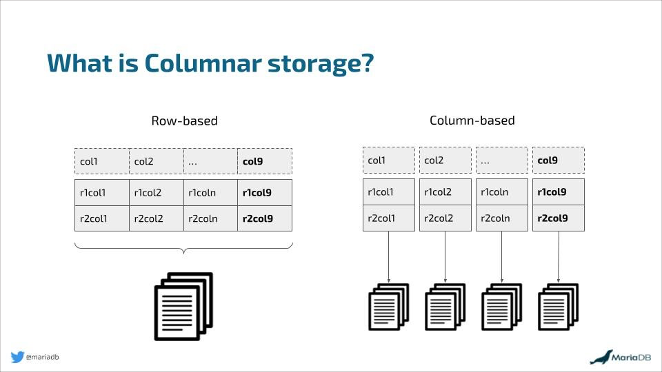

## Terminology
- Columnar Data Structure
- File Systems
- Block
- Types of File System
- Cluster vs Node

### 1. What is Columnar Data Structure ?

In Hadoop, a columnar data structure stores data by columns instead of rows, optimizing it for analytical queries. This approach is ideal for read-heavy operations, where only specific columns are needed for analysis. Columnar storage allows for better compression and query performance since data in each column is often homogeneous, reducing storage needs and improving efficiency.

Popular Columnar Formats:

Parquet: Best for complex data types and widely supported in Hadoop tools like Hive, Spark, and Impala.
ORC: Optimized for Hive and OLAP queries, providing high compression and performance.
HBase: A columnar store built on top of HDFS, designed for fast random read/write operations, making it suitable for real-time analytics.

Advantages:

Efficient querying for large datasets by reading only necessary columns.
Better compression for storage efficiency.
Scalability for big data workloads.

Use Cases:

Data warehousing and real-time analytics.
Log and event data analysis.
Columnar formats excel in read-heavy scenarios but are less suited for write-heavy operations.

### 2. What is File System

A file system is a way an operating system organizes, stores, and retrieves data on storage devices. It manages files and directories, tracks data locations, and ensures efficient access, security, and fault tolerance.

### Examples of File Systems

| **Type**                | **File System**     | **Use Case**                                   |
|--------------------------|---------------------|-----------------------------------------------|
| **Local File Systems**   | NTFS               | Default for Windows; supports large files.    |
|                          | ext4               | Common in Linux; reliable and fast.           |
|                          | APFS               | Default for macOS; optimized for SSDs.        |
|                          | FAT32              | Cross-platform; used in USB drives.           |
| **Distributed File Systems** | HDFS           | Big data storage in Hadoop ecosystems.        |
|                          | Google File System | Scalable storage for Google's services.       |
|                          | Amazon S3          | Cloud storage for distributed applications.   |
| **Special-Purpose FS**   | exFAT              | Supports large files; ideal for flash drives. |
|                          | ISO 9660           | File storage for optical discs (CD/DVD).      |

### 3. What is a Block?
It is the smallest unit of data that a file system can read or write at once.

Size : Block size depends on file system

| **File System**    | **Typical Block Sizes**  | **Usage in Big Data**                                                                 |
|--------------------|--------------------------|---------------------------------------------------------------------------------------|
| **HDFS (Hadoop Distributed File System)** | 128 MB to 256 MB       | Optimized for large file storage; larger blocks improve throughput and reduce metadata overhead. |
| **HBase**          | 64 KB to 256 KB           | Columnar store built on top of HDFS, uses smaller block sizes for better random read/write performance. |
| **Ceph**           | 4 KB to 8 MB              | Distributed storage for large-scale data; adjustable block sizes for flexibility in performance. |
| **Amazon S3 (Object Storage)** | Varies (no fixed block size, object-based) | Cloud-based object storage for big data, typically used with systems like EMR, Redshift. |
| **ZFS**            | 512 bytes to 128 KB       | Used for high-performance storage, adjustable block sizes allow optimization for different workloads. |

### 4. Types of File System

There are usually two types of File systems

1. Standalone File Systems
File systems are typically used on single machines (either desktop or server) 
- FAT (File Allocation Table)
- NTFS (New Technology File System)
- ext (Extended File System)

2. Distributed File Systems
They are designed to work across multiple machines in a distributed network, offering features like fault tolerance, data replication, and scalability for large datasets.
- HDFS (Hadoop Distributed File System)

### 5. Cluster and Nodes

