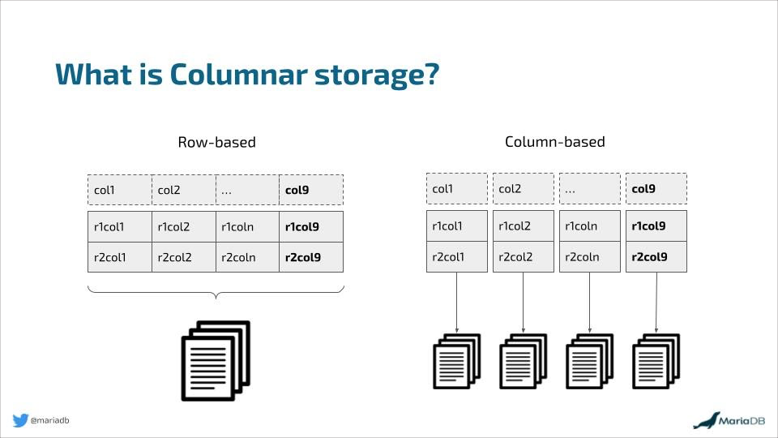
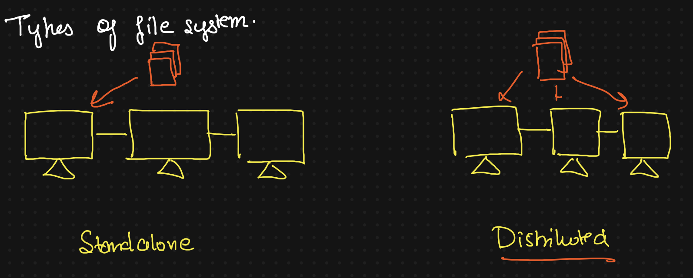
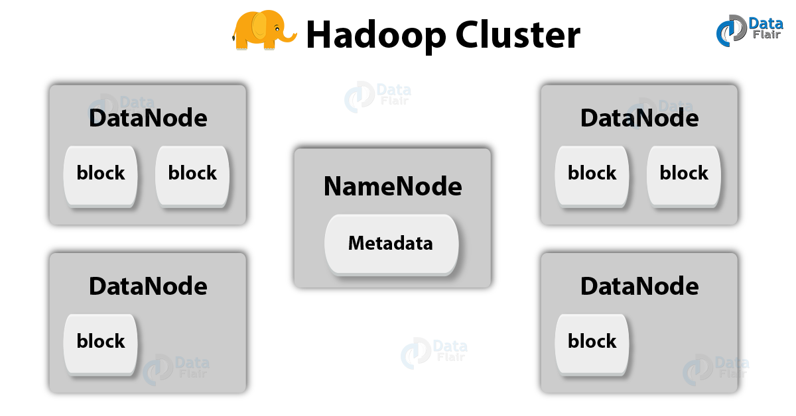
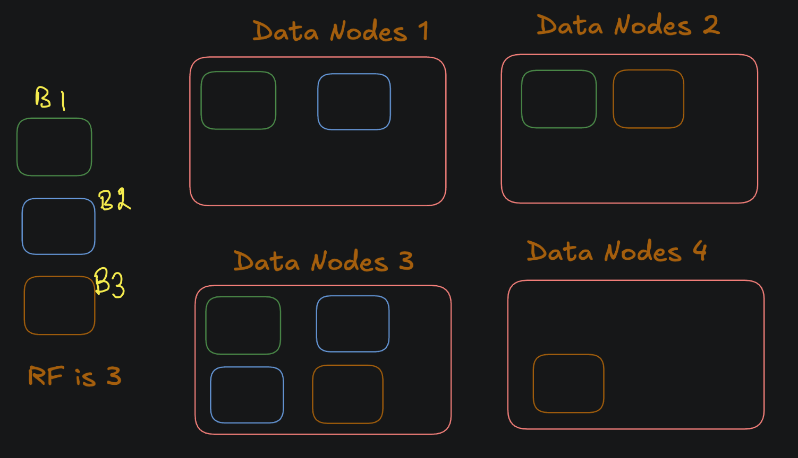

## Terminology
- Columnar Data Structure
- File Systems
- Block
- Types of File System
- Nodes vs Cluster
- Process vs Daemon Process
- Meta Data
- Data Replication
- SPOF
- HA

### 1. What is Columnar Data Structure ?

In Hadoop, a columnar data structure stores data by columns instead of rows, optimizing it for analytical queries. This approach is ideal for read-heavy operations, where only specific columns are needed for analysis. Columnar storage allows for better compression and query performance since data in each column is often homogeneous, reducing storage needs and improving efficiency.

Popular Columnar Formats:

Parquet: Best for complex data types and widely supported in Hadoop tools like Hive, Spark, and Impala.
ORC: Optimized for Hive and OLAP queries, providing high compression and performance.
HBase: A columnar store built on top of HDFS, designed for fast random read/write operations, making it suitable for real-time analytics.

Advantages:

Efficient querying for large datasets by reading only necessary columns.
Better compression for storage efficiency.
Scalability for big data workloads.

Use Cases:

Data warehousing and real-time analytics.
Log and event data analysis.
Columnar formats excel in read-heavy scenarios but are less suited for write-heavy operations.

### 2. What is File System

A file system is a way an operating system organizes, stores, and retrieves data on storage devices. It manages files and directories, tracks data locations, and ensures efficient access, security, and fault tolerance.

### Examples of File Systems

| **Type**                | **File System**     | **Use Case**                                   |
|--------------------------|---------------------|-----------------------------------------------|
| **Local File Systems**   | NTFS               | Default for Windows; supports large files.    |
|                          | ext4               | Common in Linux; reliable and fast.           |
|                          | APFS               | Default for macOS; optimized for SSDs.        |
|                          | FAT32              | Cross-platform; used in USB drives.           |
| **Distributed File Systems** | HDFS           | Big data storage in Hadoop ecosystems.        |
|                          | Google File System | Scalable storage for Google's services.       |
|                          | Amazon S3          | Cloud storage for distributed applications.   |
| **Special-Purpose FS**   | exFAT              | Supports large files; ideal for flash drives. |
|                          | ISO 9660           | File storage for optical discs (CD/DVD).      |

### 3. What is a Block?
It is the smallest unit of data that a file system can read or write at once.

Size : Block size depends on file system

| **File System**    | **Typical Block Sizes**  | **Usage in Big Data**                                                                 |
|--------------------|--------------------------|---------------------------------------------------------------------------------------|
| **HDFS (Hadoop Distributed File System)** | 128 MB to 256 MB       | Optimized for large file storage; larger blocks improve throughput and reduce metadata overhead. |
| **HBase**          | 64 KB to 256 KB           | Columnar store built on top of HDFS, uses smaller block sizes for better random read/write performance. |
| **Ceph**           | 4 KB to 8 MB              | Distributed storage for large-scale data; adjustable block sizes for flexibility in performance. |
| **Amazon S3 (Object Storage)** | Varies (no fixed block size, object-based) | Cloud-based object storage for big data, typically used with systems like EMR, Redshift. |
| **ZFS**            | 512 bytes to 128 KB       | Used for high-performance storage, adjustable block sizes allow optimization for different workloads. |

### 4. Types of File System

There are usually two types of File systems

1. Standalone File Systems
File systems are typically used on single machines (either desktop or server) 
- FAT (File Allocation Table)
- NTFS (New Technology File System)
- ext (Extended File System)

2. Distributed File Systems
They are designed to work across multiple machines in a distributed network, offering features like fault tolerance, data replication, and scalability for large datasets.
- HDFS (Hadoop Distributed File System)

### 5. Node vs Cluster

- Node: An individual computer in a cluster.
NameNode: Stores metadata about the HDFS, such as file names, directory structure, and block locations.
DataNode: Stores the actual data in blocks.

- Cluster: A group of connected computers (Nodes) working together as one system.

### 6. Process vs Daemon Process

Process: A regular process that runs when triggered. For example, a MapReduce job in Hadoop that processes data is a regular process. It starts, performs the computation, and ends.

Daemon Process: A daemon process runs continuously in the background to maintain the system's functionality. Examples in Hadoop include:

NameNode: Manages the HDFS metadata and file system namespace.
DataNode: Stores the actual data in HDFS.
ResourceManager: Manages resources in the YARN cluster.
NodeManager: Runs on each node to manage resource usage and monitor jobs.

### 7. What is Meta Data 
Data about data. It provides information about the structure, format, and properties of data, but not the actual data itself.
Example: NameNode in Hadoop
The NameNode manages metadata in HDFS, such as file names, directory structure, and block locations on DataNodes. It doesn't store the actual data but helps Hadoop locate and manage the distributed data.

The files associated with the metadata are:

FSImage (FileSystem Image): is a file that contains the complete namespace & metadata of the filesystem, such as the directory structure, file names, permissions, and block locations. It is stored in the NameNode.
EditLogs: It contains all the recent modifications made to the file system with respect to the most recent FsImage.
DataNode, Secondary NameNode, Standby Name Node

### 8. What is Replication
Replication is the process of creating multiple copies (replicas) of data across different machines or locations to ensure data availability, fault tolerance, and reliability. In case of a failure in one node, the system can still access the replicated copies of the data from other nodes.

Example in Hadoop:
In Hadoop HDFS, data is divided into blocks, and each block is replicated multiple times (by default, 3 copies) across different DataNodes. This ensures that if one DataNode fails, the data is still available from other replicas.

### 9. What is SPOF
A single point of failure (SPOF) refers to a component or part of a system that, if it fails, will cause the entire system to stop functioning. In other words, it is a critical element that, when compromised, leads to complete system downtime or operational failure.

For example, in a Hadoop cluster, if the NameNode is the only active node and it fails, the entire system becomes inoperable because it manages the file system metadata. To avoid SPOF, High Availability (HA) architectures, like having a Standby NameNode, are used to provide redundancy.

### 10. What is HA
High Availability (HA) refers to a system's ability to remain operational and provide continuous service, even in the event of failures or outages. In the context of Hadoop, HA ensures that the Hadoop cluster remains functional with minimal downtime, even if critical components, such as the NameNode, fail.

Key Features of High Availability:
Redundancy: Multiple instances of critical components (e.g., Active and Standby NameNodes) to ensure backup availability.
Automatic Failover: In the event of a failure, the system automatically switches to a backup component (e.g., Standby NameNode becomes Active).
No Single Point of Failure (SPOF): The system is designed to avoid any single failure point that would bring down the entire cluster.
Seamless Transition: Users or clients continue accessing services without noticing disruptions during failovers.

### 11. HDFS vs Cloud based Storage:
- HDFS-Based Storage: Storage and compute are tightly coupled, meaning they operate side by side on the same nodes within a cluster, optimizing for large-scale data processing.
- Cloud-Based Storage: Storage and compute are decoupled, allowing independent scaling, where storage (e.g., S3) and compute (e.g., EC2) interact over the network.