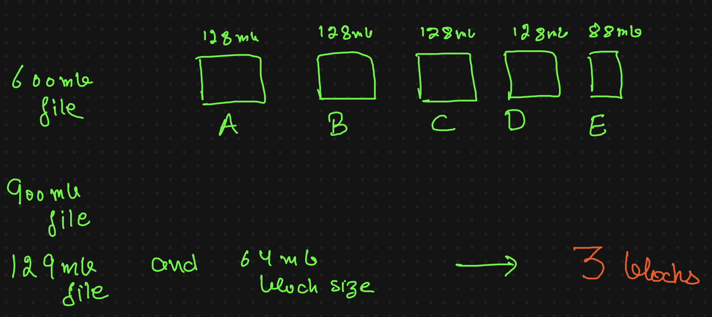

### Paralellism in HDFS
Parallelism in HDFS refers to processing multiple data blocks simultaneously across different DataNodes. This speeds up data retrieval and computation by allowing parallel tasks on separate blocks.

How it works:
Data Division: A large file is split into blocks (e.g., 128 MB).
Replication: Blocks are distributed across multiple DataNodes.
Parallel Processing: Data is processed in parallel, improving performance.
Example:
A 600 MB file split into 5 blocks (128 MB each) can be read simultaneously from different DataNodes, enhancing speed.

