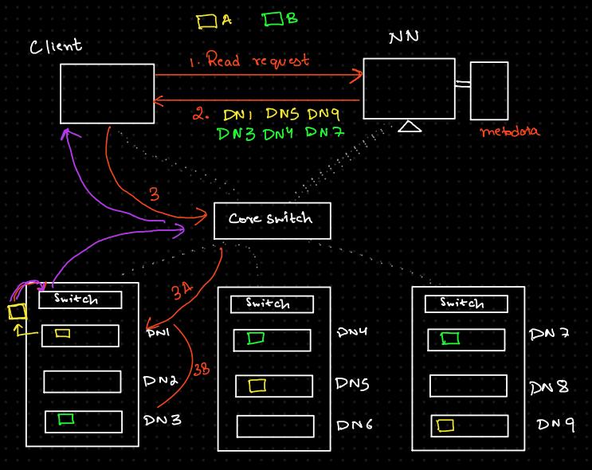

## Write and Read Operation
In HDFS (Hadoop Distributed File System), write and read operations refer to how data is stored and accessed in a distributed environment.

### Read Operation

#### Process
To read a file from HDFS, the client opens the file it wishes to read, and the Distributed Filesystem communicates to the NameNode for the metadata. The NameNode responds with the number of blocks, their location, and their details. The client then calls read() on the stream returned by the Distributed Filesystem, and it connects to the first (closest) datanode for the first block in the file. When a block ends, DFSInputStream will close the connection to the datanode, then find the best datanode for the next block. This happens transparently to the client, which from its point of view, is just reading a continuous stream. When the client has finished reading, it calls close() on the FSDataInputStream.

#### Steps
| Step                    | Description                                                   |
|-------------------------|---------------------------------------------------------------|
| 1. **File Request**      | Client requests to read a file.                               |
| 2. **NameNode Lookup**   | Client queries NameNode for block locations.                 |
| 3. **Block Retrieval**   | Client retrieves blocks directly from DataNodes.             |
| 4. **Data Transfer**     | Data is transferred from DataNodes to client.                |
| 5. **Fault Tolerance**   | If a block is unavailable, it's fetched from another replica. |
| 6. **Completion**        | Client receives the full data after reading all blocks.      |

### Write Operation

#### Process
To write a file to HDFS, the client first opens the file and writes data to the Distributed Filesystem. The client then communicates with the NameNode to check where the blocks should be stored. The NameNode responds with the locations of the DataNodes where the blocks will be placed. The client then initiates the write process, starting by writing data to the first DataNode. Once a block is full, the DFSOutputStream closes the connection to the first DataNode and connects to the next DataNode in the replication chain. The data is replicated across the DataNodes according to the replication factor set for the file. This process continues until all blocks are written. After the file is completely written and all blocks are replicated, the client receives an acknowledgment from the NameNode that the file has been successfully stored in HDFS. Finally, the client calls close() on the FSDataOutputStream to finish the write operation.

### Steps
| Step                    | Description                                                   |
|-------------------------|---------------------------------------------------------------|
| 1. **File Split**        | File is split into fixed-size blocks (128MB or 256MB).        |
| 2. **NameNode Request**  | Client requests NameNode for block storage locations.         |
| 3. **Block Assignment**  | NameNode assigns DataNodes for block storage.                |
| 4. **Data Transfer**     | Client starts writing data to the first DataNode.             |
| 5. **Replication**       | Data is replicated to other DataNodes as per the replication factor. |
| 6. **Acknowledgment**    | Client receives acknowledgment once writing is complete.     |

In read there is no acknowledgement

