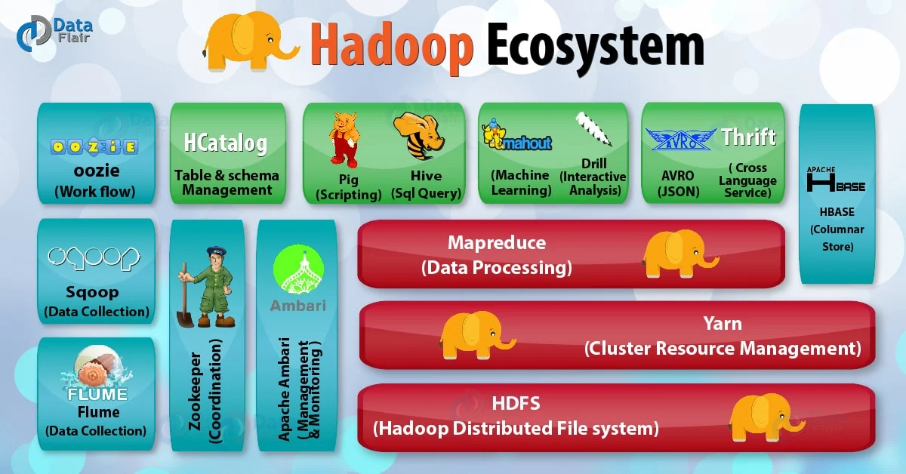

## Hadoop

is an open source tool designed to handle massive amounts of data in distributed and scalable way.

It can handle vast amounts of structured, semi-structured and unstructured data.

### Apache Ecosystem

