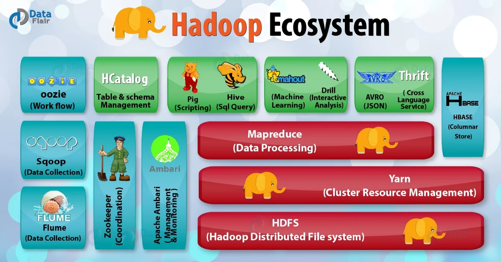

## Apache Ecosystem

### Apache Ecosystem: Key Tools for Big Data

| **Category**         | **Framework/Tool**   | **Purpose**                                         | **Key Features**                        | **Use Cases**                      |
|-----------------------|----------------------|----------------------------------------------------|------------------------------------------|------------------------------------|
| **Storage**          | **Hadoop HDFS**      | Distributed storage for big data.                  | Fault-tolerant, scalable.               | Storing massive datasets.          |
| **Computing**        | **Apache Spark**     | Distributed computing for batch and stream data.   | In-memory processing, multi-language.   | Real-time and batch analytics.     |
| **Streaming**        | **Apache Kafka**     | Distributed streaming platform.                    | High-throughput, fault-tolerant.        | Real-time data pipelines.          |
| **Querying**         | **Apache Hive**      | SQL-like querying for big data.                   | Data warehousing, ad-hoc analysis.      | Analytical queries.                |
| **Storage**          | **Apache HBase**     | NoSQL database for real-time data.                 | Random read/write access.               | Transactional applications.         |
| **Integration**      | **Apache Sqoop**     | Import/export data between Hadoop and databases.   | High-performance bulk transfer.         | ETL processes.                     |
