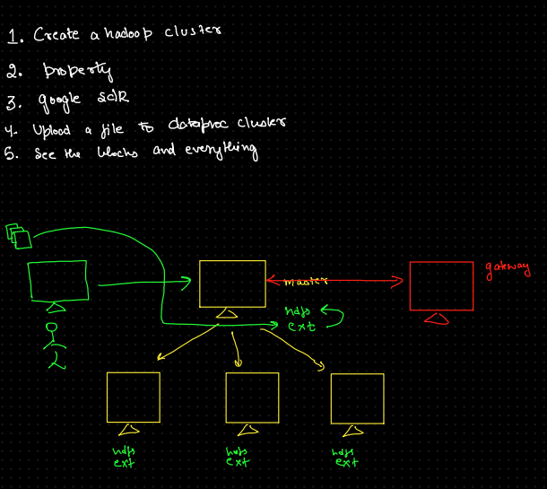

## Data Ingestion

warp prompt: use gloud command to send this file to data proc cluster
gcloud compute scp sales_data.csv cluster-113d-m:~/sales_data.csv --zone=us-central1-c

Connector: 
gcloud compute ssh "cluster-113d-m" --zone "us-central1-c" --project "tj-first-project-447820" --ssh-key-file ~/.ssh/id_rsa_new

### What is gcloud compute scp?
gcloud compute scp is a Google Cloud CLI command that simplifies the process of securely copying files to or from Google Compute Engine (GCE) instances

### Steps

