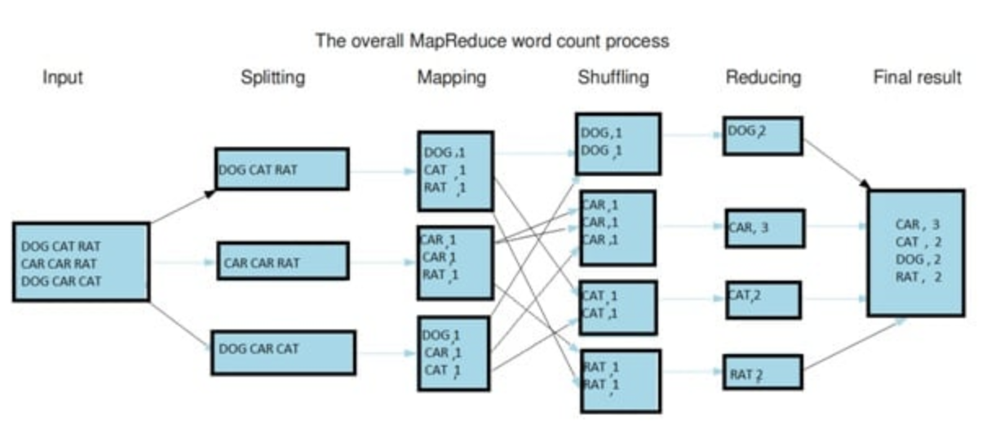

## Working of MR
it consists of two important tasks which are Map and Reduce
- Map: read sand process a certain amount of data and produce key-value pairs.
- Reduce: collects and aggregates the key-value pairs and gives the final output. 

### Stages in MR

a) Input Splits: Input data is divided into smaller units (splits), each processed by a Map task.
b) Mapping: Processes each split to generate intermediate key-value pairs (e.g., words and their counts).
c) Shuffling: Groups and combines intermediate outputs based on keys (e.g., words).
d) Reducing: Aggregates shuffled data to produce the final output (e.g., word frequencies).