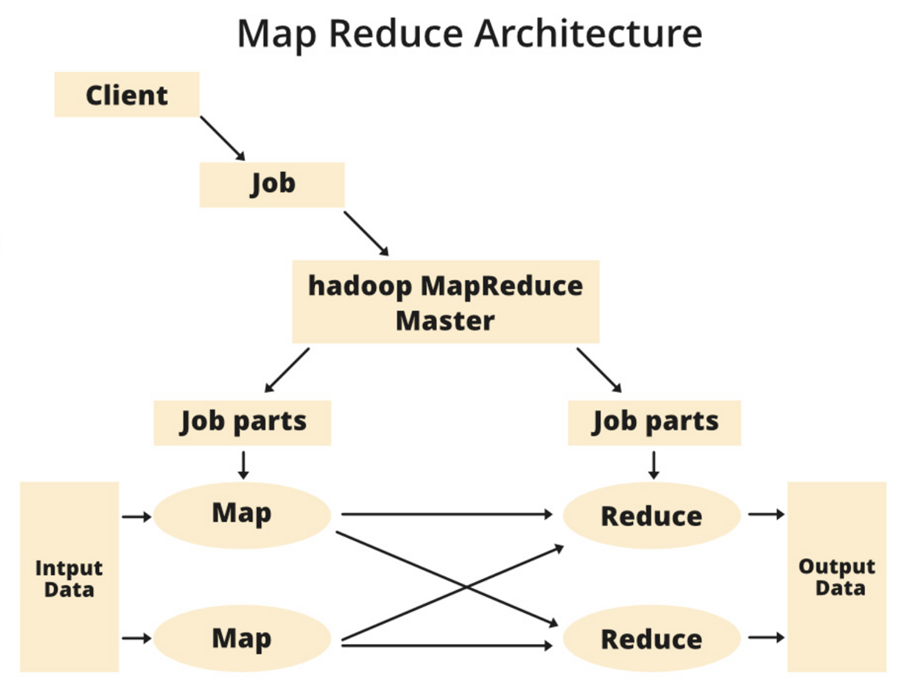

## MR Architecture

- Client: Sends jobs (tasks) to the MapReduce system for processing.
- Job: Represents the work to be done, broken into smaller tasks for processing.
- Hadoop MapReduce Master: Divides the main job into smaller job-parts for distributed processing.
- Job Parts: The smaller tasks created from the main job; their results are combined to produce the final output.
- Input Data: The raw data provided for processing.
- Output Data: The processed, final result after completing all tasks.

### Key Components:
- Job Tracker: Manages and schedules jobs across the cluster, dividing them into tasks.
- Task Tracker: Executes tasks on data nodes as per Job Tracker's instructions.

### Summary:
MapReduce processes massive unstructured data efficiently by splitting jobs into smaller tasks, running them in parallel, and combining the results. It ensures scalability and speed, making it essential for big data processing.